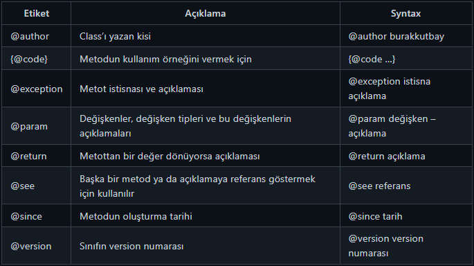

Yorum Satırları.
-
- Yorum satırları, kod içi belgeleme amacıyla kullanılan ve derleyiciler tarafından dikkate alınmayan kod parçalarıdır. Yorum satırları oluşturmamızın sebebi, Yazdığı kodun kritik kesimlerini açıklayarak, o koda daha sonra bakan kimselerin (büyük olasılıkla kendisinin) işini kolaylaştırmak amaçlanmaktadır. Java’da yorum satırları 3 farklı şekilde yazılır:

- // ile yapılan yorumlar
  Tek satırlık bir açıklama yapılacaksa o satırın başına // işareti yazılır. ; // işaretinden sonra satır sonuna kadar her şey yorum olarak kabul edilir. Anlaşılacağı üzere bu işaretin satırın en başında olması zorunlu değildir. Ancak kodlama alışkanlığı bakımından satır başında kullanılması daha uygundur.

        // bu bir yorum satırıdır
        int number = 10; // number değişkenine 10 değeri atandı.

- /* ... */ ile yapılan yorumlar
  Eğer birden fazla satırda yazılan bir açıklama varsa, her satırın başına // işareti koymak programcıya zor gelebilir. Bunun yerine, açıklama olarak değerlendirilmesi istenen satırlar /* ve */ işaretleri arasına alınır. Bu iki işaret arasında kalan kesimler derleyici tarafından yorum satırı olarak kabul edilir.

       /* Birden fazla satırdan oluşan bir yorum satırlarıdır. Ancak yorumların
       bu yolla ifade edilmesi için birden fazla satırdan oluşması zorunluluğu
       yoktur. */
       int number = 10; // number değişkenine 10 değeri atandı.

- /** ... */ ile yapılan açıklamalar
  Bir uygulama geliştirilirken kod içi belgeleme yapmak güzel bir programlama alışkanlığıdır. Çünkü hem yapmakta olduğunuz işi en güzel o işi yaparken açıklayabilirsiniz, hem de açıklayabildiğiniz kodu anlamışsınız demektir ve o kodu açıklayarak yazdığınız için hata yapma olasılığınız düşer.

- Öte yandan, çoğu zaman uygulamaların raporlarının oluşturulması gerekir. Kod yazıldıktan sonra kodun içine yazılan açıklamalardan bir belge oluşturarak bu belgeyi raporun sonuna eklemek programcının yükünü hafifletecektir. İşte şimdi bahsedeceğimiz üçüncü yöntem bu amaçla kullanılır. /** ve */ işaretleri arasına yazılan açıklamalar bir takım özel etiketler içerebilir. Kod içi belgeleme, bu etiketleri tanıyan ve etiketlerden faydalanarak belge üreten bir aracın yardımı ile belgeye dönüştürülebilmektedir.

- Bu tarzda yazılan açıklama satırlarına Javadoc adı verilmektedir. Javadoc için kullanılabilecek bazı örnekler ve ne için kullanılabilecekleri aşağıda listelenmiştir:
- 
        /**
          * @author M.Mustafa Çetindağ - 11.Nis.2021
            */
            public class AciklamaSatiriOrnegi {
            /**
              * Verilen sayının karekökünü bularak döndürür.
              * Sayının sıfırdan küçük olmadığını varsayar.
              *
              * @param sayi Karekökü alınacak sayı
              * @return Sayının karekökü
                */public double karekok(double sayi) {
                double kkok = 0;
                // burada karekök bulma algoritmasının çalıştığını kabul edelimreturn kkok;
                 }
                }